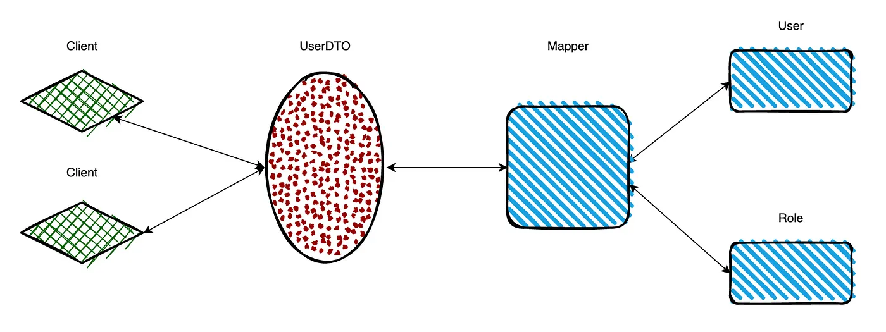

# Streamlining Data Transfer with `DTO` Pattern

In today's world of software, we're often moving loads of data around behind the scenes of our apps. Sometimes, though, we end up sending more data than we really need to. This extra data can slow things down and put a strain on our servers.

That's where the Data Transfer Object (DTO) pattern comes in handy. It's like a special helper that makes sending data more efficient. In this article, we'll break down what DTOs are, why they're useful, and how you can use them.

## What are DTOs?
Think of DTOs as messengers that carry information between different parts of your app. They're simple structures that hold data, like a box holding your stuff for a move. But unlike your moving box, DTOs don't carry any complicated rules or logic. They're just there to transport data safely.

## Why Use DTOs?

Imagine you have a user profile in your app with lots of details: name, address, password, and more. When showing this info to users, you might not want to share everything, like their password or some other sensitive data. 
With DTOs, you can create a simplified version of the user profile that only includes what's needed, keeping things secure and efficient.

See the below illustration to understand the interactions between components.



## Illustrating DTOs

So let's imagine a scenario where we have a User entity with attributes like `id`, `name`, `address`, `password`, and `roles`. When serving client requests, we may not want to expose sensitive information like `passwords` or irrelevant details such as `internal IDs`. Here's where DTOs come into play:
```java
public class UserDTO {
    private String name;
    private String address;
    private List<Role> roles;
    
    // Constructors, getters, setters
}
```

By crafting a UserDTO, we can selectively include only the necessary data for client consumption, thereby reducing network overhead and enhancing security.

## Mapping Data with Mappers

To facilitate seamless data transfer between DTOs and domain entities, we employ `mapper` components. These mappers abstract the mapping logic, ensuring that both DTOs and domain models remain decoupled. For instance:

```java
@Component
class Mapper {
    public UserDTO toDto(User user) {
        String name = user.getName();
        String address = user.getAddress();
        List<String> roles = user.getRoles().stream()
                            .map(Role::getName)
                            .collect(toList());
        return new UserDTO(name, address, roles);
    }
}
```
By leveraging mappers, we enable efficient conversion of domain objects to DTOs, minimizing complexity and promoting code maintainability.

You may also produce the one that takes UserDTO as input and gives you the User entity as a response.

## When to Use the DTO Pattern

DTOs help to reduce the number of transactions that are being made all around the application.

DTOs also help when the domain model is composed of many different objects and the presentation model needs all their data at once, or they can even reduce roundtrip between client and server.

A layer of DTO isolates the domain model from the presentation, resulting in both loose coupling and optimized data transfer. So the scenario is obvious here.

`With DTOs, we can build different views from our domain models`, allowing us to create other representations of the same domain but optimizing them to the client’s needs without affecting our domain design. Such flexibility is a powerful tool to solve complex problems.

Furthermore, the adoption of DTO adds a good deal of flexibility to the service layer and subsequently to the design of the entire application. For example, if DTOs are used, a change in the requirements that forces a move to a different amount of data doesn’t have any impact on the service layer or even the domain. You modify the DTO class involved by adding a new property but leave the overall interface of the service layer intact.


