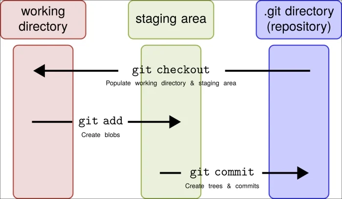

# Understanding Git: A Guide to Version Control

## Introduction:
Git is a powerful tool used by developers worldwide for version control. Whether you're a seasoned developer or just starting out, understanding Git is essential for effective collaboration and project management. In this friendly guide, we'll explore what Git is, why it's important, and how you can start using it in your projects.

## What is Git?
Git is a distributed version control system (DVCS) that tracks changes in files and directories. It allows multiple developers to collaborate on projects simultaneously, keeping track of every modification made to the codebase, _so we can use it as a tool to keep tracking the changes that we have in our codebase_.

# A small breakdown of Git's architecture:

Before we dive into the nitty-gritty of Git, let's talk about its basic structure. Imagine Git as the brain behind your project, keeping track of every change you make. But how does it do that? Well, it's all about three key parts:`the place where you work`, `the space where you prepare your changes`, and `the secret storage room where everything is kept safe`. Let's break it down and make sense of Git's simple but powerful architecture.

***Working Directory*** `the place where you work`:
+ The working directory is simply the directory on your local machine where you're actively working on your project.
+ It's typically the main folder for your project, where you'll find all your files and directories.
+ For example, if you're working on a project called "MyAwesomeApp" on your desktop, the working directory might be:
```bash 
/Users/YourUsername/Desktop/MyAwesomeApp/
```
+ Here, you'll find all your project files, including HTML, CSS, JavaScript, images, etc.


***Staging Area (Index)*** `the space where you prepare your changes`:
+ The staging area, also known as the index, is a file maintained by Git that stores information about what will go into your next commit.
+ It's not something you'll directly interact with as a separate directory like the working directory.
+ However, conceptually, you can think of it as a virtual space where you prepare your changes before committing them to the repository.
+ The staging area resides within the Git directory (.git) of your project, when we use `git add` commande, we can see some changes happend in the `.git/index` file.
+ You won't find it exposed in your project directory structure, but it's an integral part of Git's workflow.


***Local Repository*** `the secret storage room where everything is kept safe`:
+ The local repository is where Git stores all the metadata and object database for your project.
+ Within this directory, Git stores information about commits, branches, tags, configuration settings, and more.
+ While you won't typically interact directly with the contents of this directory, it's crucial for Git's functioning.
+ Here's an example of what the directory structure might look like:
```bash 
/Users/YourUsername/Desktop/MyAwesomeApp/.git/
```
+ Inside the ".git" directory, you'll find various subdirectories and files that Git uses to manage your project's version control.




## Key Concepts:
+ `Repositories`: Git operates within repositories, which are essentially folders containing your project files along with Git's tracking information.
+ `Commits`: A commit is a snapshot of your project at a specific point in time. Each commit records changes made since the last snapshot.
+ `Branches`: Git allows you to work on different features or fixes simultaneously by creating branches. Branches isolate changes, making it easier to manage and merge them back into the main codebase.
+ `Merging`: Merging combines changes from different branches into one. This is essential for integrating features developed separately back into the main project.
+ `Pull Requests`: In collaborative environments, developers use pull requests to propose changes and discuss them with the team before merging them into the main branch.

## Basic Commands:
+ ***Initialize a new Git repository in the current directory***
```bash 
    git init 
```

+ ***Create a local copy of a remote repository on your machine***
```bash 
    git clone [repository-URL]
```

+ ***Add changes in a file or directory to the staging area***
```bash 
    git add [file/directory/all*]
```

+ ***Record changes staged in the staging area and creates a new commit***
```bash 
    git commit -m "Commit message"
```

+ ***Display the current status of the repository, including tracked/untracked files and changes to be committed***
```bash 
    git status 
```

+ ***Show a history of commits in the repository, including commit messages, authors, and timestamps***
```bash 
    git log 
```

+ ***List all local branches in the repository***
```bash 
    git branch
```

+ ***Switche to the specified branch***
```bash 
    git branch [branch-name]
```

+ ***Merge changes from the specified branch into the current branch***
```bash 
    git merge [branch-name]
```

+ ***Fetche changes from the remote repository and merges them into the current branch***
```bash 
    git pull
    ##  is a combination of two operations: git fetch followed by git merge
```

+ ***Add a remote repository with a given name and URL***
```bash 
    git remote add [name] [repository-URL]
```

+ ***Download objects and refs from another repository***
```bash 
    git fetch [remote]
    ## git fetch only brings changes to your local repository without modifying your working branch
```

+ ***Unstage changes for a specific file***
```bash 
    git reset [file]
```

+ ***Resets the current branch and working directory to a specific commit***
```bash 
    git reset --hard [commit]
```

+ ***Create a new branch and switches to it***
```bash 
    git checkout -b [branch-name]
```

+ ***Show changes between commits, commit and working tree, etc***
```bash 
    git diff
```

+ ***Temporarily shelve changes in the working directory, allowing you to switch branches or perform other operations***
```bash 
    git stash
```

+ ***Applie changes from one branch onto another by reapplying commits***
```bash 
    git rebase [branch]
```

+ ***Create a lightweight tag for the current commit***
```bash 
    git tag [tag-name]
```

+ ***Remove a file from the working directory and stages the deletion***
```bash 
    git rm [file]
```

+ ***List all remote repositories along with their URLs***
```bash 
    git remote -v
```

+ ***Show information about a particular remote***
```bash 
    git remote show [remote]
```

+ ***Force the push of local commits to the remote repository, potentially overwriting existing history***
```bash 
    git push --force
```

+ ***Sets a global configuration option for Git***
```bash 
    git config --global [setting]
```

These commands cover a wide range of functionalities in Git, from basic repository management to more advanced branching and collaboration features. As you become more familiar with Git, experimenting with these commands will help you master version control for your projects. If you need further explanation on any command or have additional questions, feel free to ask! 🚀📝

## Common Workflows:

+ **`Solo Development:`** For solo projects, a simple workflow involves making changes, staging them with git add, committing them with git commit, and pushing them to the remote repository with git push.

+ **`Collaborative Development:`** In team environments, developers create branches for features or fixes, make changes, push them to remote branches, and create pull requests for review and integration.

## Conclusion
Git is a powerful tool for version control, enabling seamless collaboration and efficient project management. By understanding its key concepts and basic commands, you can effectively track changes, work on features independently, and integrate them with the main codebase. Whether you're working solo or in a team, Git is an essential skill for every developer's toolkit.

### Resources:

**Official Git Documentation**: https://git-scm.com/doc
**GitHub Guides**: https://guides.github.com/
**Atlassian Git Tutorial**: https://www.atlassian.com/git/tutorials

Start exploring Git today and unlock its full potential for your projects!
