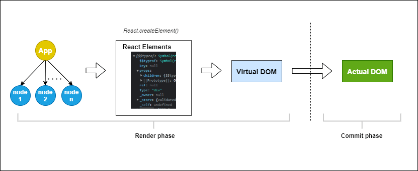
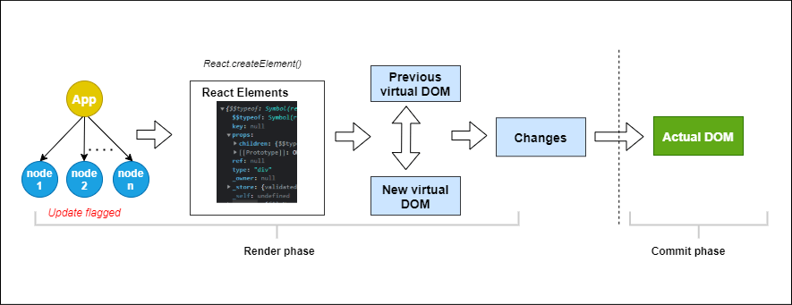

# Understanding Rendering in React

React.js has revolutionized the way web applications are built by introducing a component-based architecture and a virtual DOM (Document Object Model) for efficient rendering. Rendering in React is a complex process that involves various stages and optimizations to ensure high-performance user interfaces. In this article, we'll delve into the intricacies of rendering in React, exploring its core concepts and mechanisms.

## 1. Introduction to React Rendering

Rendering in React refers to the process of generating the UI (User Interface) based on the application's current state. Unlike traditional web development frameworks, React employs a `virtual DOM` to minimize the number of actual DOM manipulations, thereby enhancing performance.

## 2. JSX and React Elements

JSX is a syntax extension to JavaScript that allows developers to write HTML-like code within JavaScript. This JSX code gets converted to `React.createElement()` function calls, which ultimately evaluate to JavaScript objects representing React elements. Unlike browser DOM elements, React elements are lightweight and less expensive to create.

## 3. React Elements and Components

React elements are the smallest building blocks in React applications. They are plain JavaScript objects that describe what you want to see on the screen, so we do not have to worry about creating those objects as React adopts an abstraction layer that handles that with JSX (JavaScript XML).

Let’s look at React elements and their resulting JavaScript objects.

```html
<div>
  <p>This is a list</p>
  <ul>
    <li>List item 1</li>
    <li>List item 2</li>
  </ul>
</div>
```
```javascript 
{
  "type": "div",
  "key": null,
  "ref": null,
  "props": {
    "children": [
      {
        "type": "p",
        "key": null,
        "ref": null,
        "props": {
          "children": "This is a list"
        },
        "_owner": null
      },
      {
        "type": "ul",
        "key": null,
        "ref": null,
        "props": {
          "children": [
            {
              "type": "li",
              "props": {
                "children": "List item 1"
              },
              // truncated for brevity
            },
            {
              "type": "li",
              "props": {
                "children": "List item 2"
              },
              // truncated for brevity
            }
          ]
        },
        "_owner": null
      }
    ]
  },
  "_owner": null
}
```

There are several properties here. Let’s go over some of them:
+ ***$$typeof*** identifies the object as a React element and is also used to improve React’s resilience against malicious markup.
+ ***key*** is used to uniquely identify elements among siblings while mapping over an array.
+ ***ref*** is a reference to an actual DOM node. It allows you to get direct access to a DOM element or an instance of a component.
+ ***props*** can be null or an object containing properties that are passed to the component.
+ ***type*** tells React what type of HTML element to create. This can be a string (div, h1), a React component (class or function), or a React fragment.
+ ***children*** are what you want to be passed into that element. When adding multiple children, we use an array and can nest as many children as we want.

On the other hand, React components encapsulate element trees, and components can either be classes or functions. Irrespective of their type, components take props as inputs and return an element tree as output. If it is a functional component, the output is the function’s return value, and if it is a class component, the output is the return value of the render method.

React keeps track of components by creating an instance for them. Each instance has a state and a lifecycle. In class components, we can access the state and the lifecycle using the predefined lifecycle methods and the this keyword, while in functional components we use React hooks.

## 4. The Virtual DOM
At the heart of React's rendering process lies the virtual DOM. The virtual DOM is a lightweight, in-memory representation of the actual DOM. Whenever the state of a React component changes, React constructs a new virtual DOM tree by reconciling the changes.

### 4.1 Reconciliation
Reconciliation is the process of comparing the new virtual DOM with the previous one to determine the minimal set of DOM mutations required to update the UI efficiently. React uses a diffing algorithm to perform this comparison efficiently.

## 5. Component Rendering Lifecycle
React components have a well-defined lifecycle, consisting of various stages such as mounting, updating, and unmounting. Understanding these lifecycle methods is crucial for optimizing rendering performance.

### `***5.1 Class Components Lifecycle Methods***`

### 5.1.1 Mounting
+ ***constructor()***: The constructor is called when a component is initialized. It is used for initializing state and binding event handlers.
+ ***render()***: The render method returns a React element representing the UI of the component. It is invoked whenever the component needs to be re-rendered.
+ ***componentDidMount()***: This method is called after the component has been mounted into the DOM. It is commonly used for performing side effects such as fetching data from a server.

### 5.1.2 Updating
+ ***shouldComponentUpdate()***: This method determines whether the component should re-render after a state or prop change. By default, React re-renders the component whenever state or props change, but this method allows you to optimize performance by preventing unnecessary renders.
+ ***render()***: Same as in mounting phase.
+ ***componentDidUpdate()***: This method is invoked after the component has been re-rendered. It is commonly used for performing post-update side effects.

### 5.1.3 Unmounting
+ ***componentWillUnmount()***: This method is called before a component is removed from the DOM. It is used for cleanup tasks such as removing event listeners or canceling timers.

### `***5.2 Functional Components with Hooks***`

### 5.2.1 Mounting
+ ***useState()***: useState hook is used to add state variables to functional components.
+ ***useEffect(() => {}, [])***: The useEffect hook is similar to componentDidMount and componentDidUpdate combined. It is called after every render and can perform side effects like data fetching, subscriptions, or manually changing the DOM.
### 5.2.2 Updating
+ ***useState()***: Same as in mounting phase.
+ ***useEffect(() => {}, [dependencies])***: The second argument of useEffect allows you to specify dependencies. If any of these dependencies change between renders, the effect will be re-run. This is similar to componentDidUpdate.
### 5.2.3 Unmounting
+ ***useEffect(() => { return () => {} }, [])***: You can return a cleanup function from useEffect to perform cleanup when the component unmounts. This is similar to componentWillUnmount.


## 6. The Lifecycle of Rendering a Component from JSX Writing to Page Rendering
When a developer writes JSX code, it's essentially a description of how the UI should look based on the current state of the application. This JSX code is then transpiled by tools like Babel into JavaScript function calls that `create React elements`. These React elements represent the structure of the UI in the form of a virtual DOM tree.

Once the virtual DOM tree is constructed, React performs a process known as `reconciliation`. During reconciliation, React compares the new virtual DOM tree with the previous one to identify the differences. It then calculates the most efficient way to update the actual DOM based on these differences.

After reconciliation, React updates the actual DOM, reflecting the changes made to the UI. This updated UI is then rendered on the web page, providing users with an interactive and dynamic experience.

The rendering process can be divided into the Render and Commit phases.
Below is a visual description of the rendering process for initial render.



Below is a visual description of the rendering process when an application re-renders.



## 7. Why JSX Elements are Less Expensive to Create

JSX elements are less expensive to create compared to other DOM elements due to several reasons:

+ ***Virtual DOM***: JSX elements are lightweight representations of the actual DOM elements. They exist in memory as JavaScript objects within the virtual DOM, which makes them faster to create and manipulate compared to actual browser DOM elements.
+ ***Batched Updates***: React batches multiple updates to the virtual DOM, reducing the number of re-renders and DOM manipulations. This batching mechanism improves performance when creating and updating JSX elements.
+ ***Diffing Algorithm***: React's diffing algorithm efficiently identifies the differences between the current and previous virtual DOM trees, minimizing unnecessary updates to the actual DOM. This optimization further reduces the cost of creating JSX elements.

## 8. Optimizing Rendering Performance
To ensure smooth and responsive user interfaces, it's essential to optimize rendering performance in React. Some key strategies include:

+ ***Minimize unnecessary renders***: Use `shouldComponentUpdate` or `React.memo` to prevent re-renders when the component's props or state haven't changed.
+ ***Use key prop effectively***: When rendering lists of components, assigning a `unique key` to each item helps React identify which items have changed, minimizing unnecessary re-renders.
+ ***Memoization***: Memoization techniques such as memoizing expensive computations or caching data can significantly improve rendering performance.
+ ***React Profiler***: React Profiler is a built-in tool for profiling and analyzing the performance of React applications. Use it to identify rendering bottlenecks and optimize accordingly.

## Conclusion
Rendering in React is a sophisticated process that involves JSX, virtual DOM reconciliation, component lifecycle methods, and various optimization techniques. By understanding these concepts and employing best practices, developers can build high-performance React applications that deliver exceptional user experiences. Whether you're a beginner or an experienced React developer, mastering rendering in React is essential for building modern web applications efficiently.

